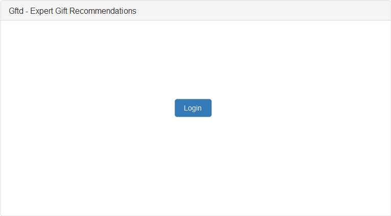
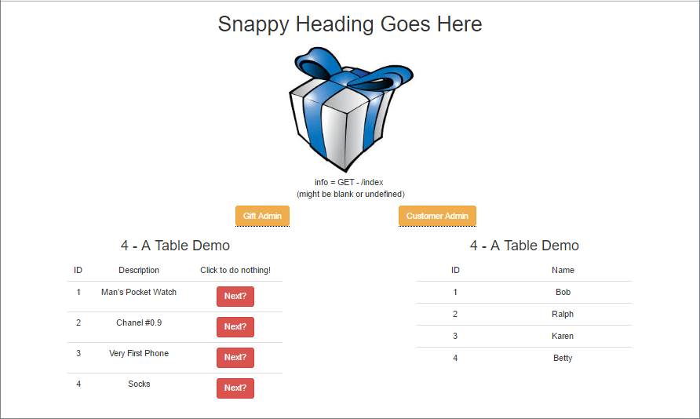
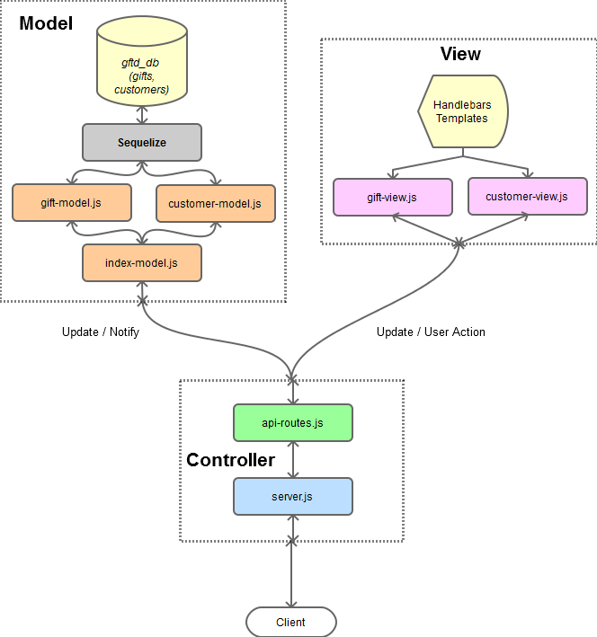

# A holiday gift recommendation application - NU926fsf - Team Project

# Table of Contents

* [Overview](#overview)
* [Usage](#usage)
  * [Running from Heroku](#running-from-heroku)
    * [URLs](#urls)
    * [Features](#features)
    * [Screen Shots](#screen-shots)
      * [Index Page](#index-page)
      * [Sample Site Page](#sample-site-page)
* [Architecture](#architecture)
  * [MVC Architecture Overview](#mvc-architecture-overview)
  * [Application Folder Structure](#application-folder-structure)
* [Miscellaneous Development Notes](#miscellaneous-development-notes)
  * [Handlebars](#handlebars)
  * [HTML Notes](#html_notes)
  * [Heroku Deployment](#heroku-deployment)
    * [Errors on Heroku](#errors-on-heroku)
    * [Other Heroku Behavior](#other-heroku-behavior)
  * [Toolboxes](#toolboxes)
    * [Windows](#windows)
    * [MacOS](#macos)
* [References](#references)

# Overview

Our application is holiday gift recommendation application based on the holiday and some criteria. The user logs in, completes questionnaire and gifts are recommended based on the results of the questionnaire. User can return to the site and view past searches. We save search criteria, and user has ability to rate products, which can be a selection count. Higher something is rated, the higher rating displays it first. Allow users to suggest gifts. If they get suggestions but don't see what they want, they can add it. Can use a selection count for each item that adds weight to the item. It is intended to demonstrate - 

* Writing code for the NodeJS environment.
* Use of the following NodeJS modules - 
 * fs
 * Express - <https://www.npmjs.com/package/express>
 * express-handlebars - <https://www.npmjs.com/package/express-handlebars>
 * sequelize - <https://www.npmjs.com/package/mysql>
   * mysql - Required by `sequelize`.
 * time-stamp - <https://www.npmjs.com/package/time-stamp>
 * string - <https://www.npmjs.com/package/string>
 * file-exists - <https://www.npmjs.com/package/file-exists>
 * path - <https://www.npmjs.com/package/path>
 * body-parser - <https://www.npmjs.com/package/body-parser>
* Javascript - 
 * call backs
 * node events
 * MVC Design Pattern

# Usage

This application has been deployed to Heroku as per the assignment, but it can also be ran locally.

## Running from Heroku

At the time when this assignment was submitted the application has been deployed to Heroku. Its URL is - 

    Heroku link is provided in the homework submission
    
*NOTE: The `:3000` port selection is not necessary, there is a `PORT` environment variable that contains the port number to be used.*

### URLs

The following URLs are recognized by the server and will serve pages - 

* `https://deployed-server/` - displays the *index* page
* `https://deployed-server/index` - displays the *index* page
* `https://deployed-server/admin` - displays an *admin* 
* `https://deployed-server/cust` - displays a page where customers can be added or deleted.

### Features

The following features have been implemented - 

### Screen Shots

#### Index Page

<p align="center">
  
</p>

#### Sample Site Page

<p align="center">
  
</p>

# Architecture

I have used an architecture that differs a little from what was specified in the homework assignment. Here are the key differences - 

* `method-override` - I did not use this package. **The assignment instructions did not indicate any need for use.**
* `views` folder content - this folder contains the *views* `burger-view.js`, `customer-view.js`, and the following Handlebars templates - 
  * `views/layouts/main.handlebars`
  * `views/index.handlebars`
  * `views/admin.handlebars`
  * `views/init.handlebars`
  * `views/cust.handlebars`
  * `views/custinit.handlebars`

## MVC Architecture Overview

The following diagram illustrates the *basic* architecture used in this application -

<p align="center">
  
</p>

## Application Folder Structure

The following folder structure is used - 

    /burgerSequelize─┐              
                     │
                     ├───config     
                     │
                     ├───db         
                     │
                     ├───models     
                     │
                     ├───public     
                     │   │
                     │   └───assets 
                     │       │
                     │       ├───css
                     │       │
                     │       └───img
                     │
                     ├───routes
                     │
                     └───views      
                         │
                         └───layouts

# Miscellaneous Development Notes

## Handlebars

I found Handlebars to be a useful Node package. It has a lot of potential, but the learning curve is somewhat steep in regards to the more advanced capabilities.

One challenge in using Handlebars was the customer drop down list. This was because it is *nested* within a portion of Handlebars code that comprises an `{{#each burgers.eat }}` loop. This meant that the sibling `burgers.customers` of `burgers.eat` isn't accessible directly. The solution was to use `@root`. For example - 

```html
    <tbody id="burgerEatTable" data={{burgers.customers.length}}>
        {{#each burgers.eat }}
        <tr>
            <form method="post" target="_self" action="/index">
                <td>{{this.id}}</td>
                <td>{{this.burger_name}}</td>
                <td>
                    <select id="burgcust" name="burgcust" type="text" class="ui fluid dropdown" required>
                        <option value="">Name?</option>
                        {{#each @root.burgers.customers}}
                            <option value={{this.id}}>{{this.customer_name}}</option>
                        {{/each}}
                    </select>
                </td>
                <td>
                    <input id="burgerid" name="burgerid" type="hidden" value={{this.id}}>
                    <input id="burgerdev" name="burgerdev" type="hidden" value={{this.devoured}}>
                    <button type="submit" class="btn btn-danger">Devour!</button>
                </td>
            </form>
        </tr>
        {{/each}}
    </tbody>
```

The data used in rendering is kept in an object - 

    var renderdata = {
        customers: [],      // customer list
        count: 0,           // total count of burgers
        eat: [],            // burgers to be eaten(devoured)
        ate: []             // burgers that have been eaten
    };

## HTML Notes

There are no site-owned Javascript files used in any of the rendered HTML pages. The *only* static file is `/public/assets/css/burger.css`.

## Heroku Deployment

Deployment to Heroku for the most part is straight forward and easy to accomplish. However, several key steps should be noted :

* For this application it is necessary to set up a database on Heroku and modify the `config/config.json` file to use the correct credentials. **JawsDB** is the recommended choice for a database.

* Edit your `package.json` file (*after it's been created with* `npm init`) so that it contains - 

```javascript
    "engines": {
       "node": "6.9.4"
     }
```

**Where :** `"node": "6.9.4"` indicates the *version* of Node that you want your application use. This application is using the same version that was used locally during development.

* The *listening* port requires some special consideration. Although it is configured, that value will not be used when running on Heroku. The following links provided useful information - 

Provided the necessary information for editing the `packages.json` file :

<https://devcenter.heroku.com/articles/deploying-nodejs>

The top *answer* provided the details needed for managing the port number :

<http://stackoverflow.com/questions/31092538/heroku-node-js-error-r10-boot-timeout-web-process-failed-to-bind-to-port-w>

* The deployment steps I used are - 

1. `heroku login`
2. `heroku create`
3. `git push heroku master`

Heroku is now ready to serve the application. After the initial deployment and subsequent file modifications, and after committing and pushing the changes to Git then only step 3 is required.

**Don't forget to `heroku logout` when done!**

### Errors on Heroku

Heroku *logs* the output from the server application. And it can be viewed from the Heroku dashboard. This log is useful when troubleshooting issues on Heroku.

### Other Heroku Behavior

When a node server application is deployed on Heroku several things will happen - 

1. Heroku will start the application as specified in the `package.json` file. 
2. When server application runs Heroku will assign a port to it, so it's necessary for the server application to read the `PORT` environment variable. 
3. If the application is idle for a period of time Heroku will **kill** the process. Then upon the next connection it will start the application again. The only visible side effect is that it will take a little longer to load a page *on the first time*  after Heroku has killed the process.

